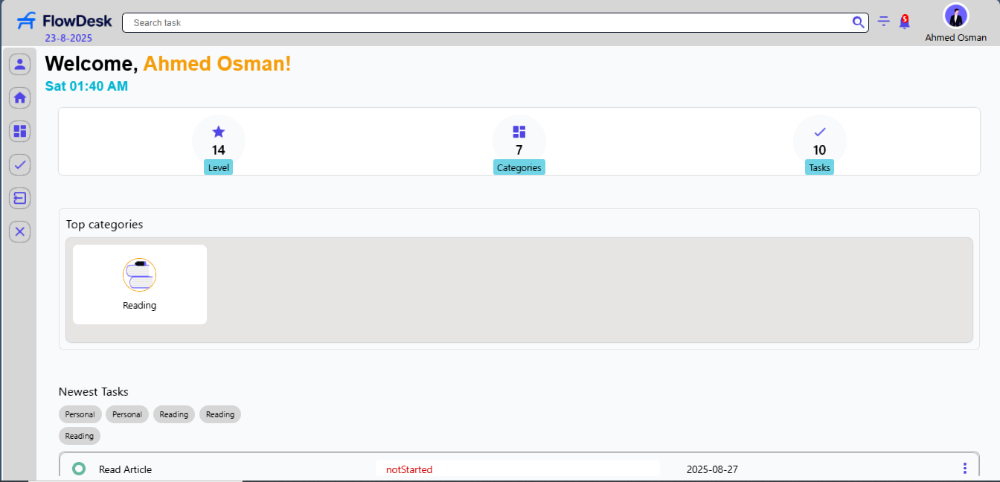
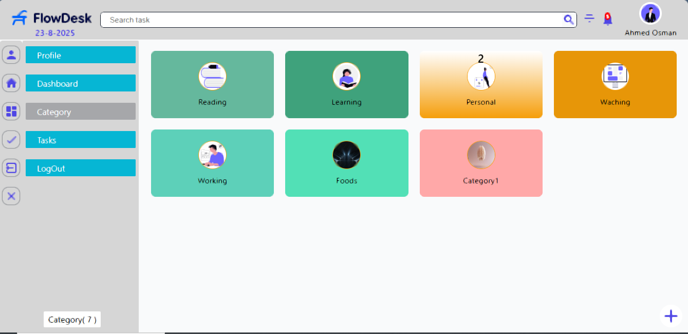
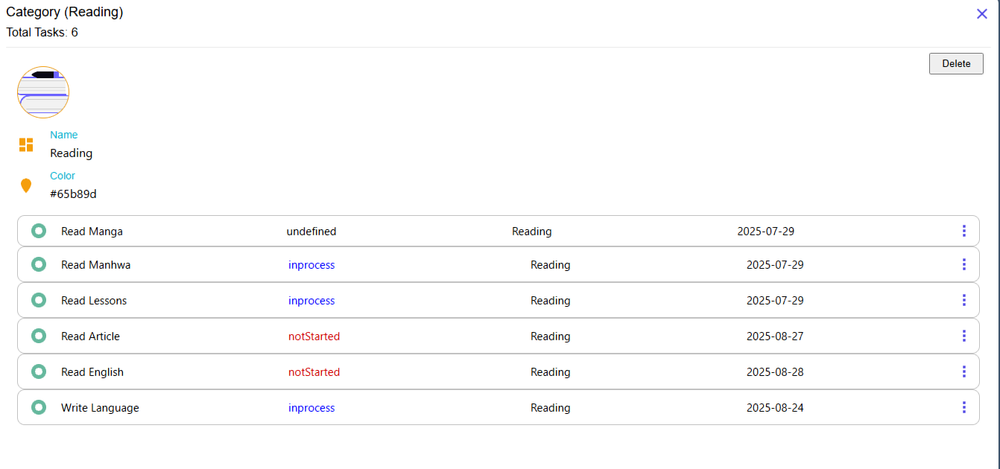
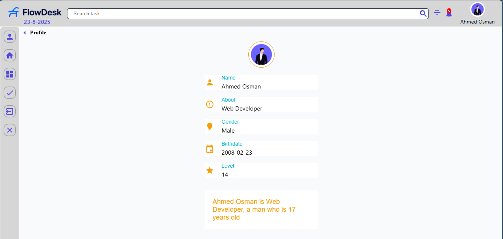
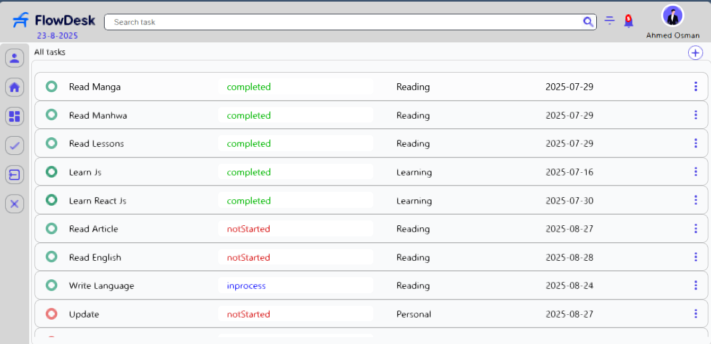
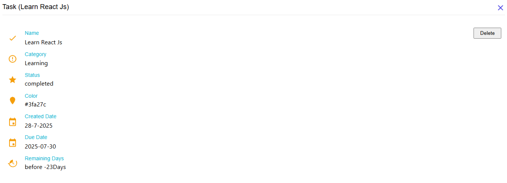

# FlowDesk - Task & Category Management App

**Version:** 1.0  
**Tech Stack:** HTML, CSS, Vanilla JavaScript, LocalStorage  

## 🚀 About FlowDesk
FlowDesk is a modern task management dashboard that helps users stay organized with categories, tasks, and notifications.
Built using **vanilla JavaScript** this is the **first version** of the app.
A **React-powered version (v2)** is coming soon!  

---

## ✨ Features
✅ **User Registration**  
- Add **name**, **profile image**, **birthdate**, **gender**, and a short bio.  
- Data saved in **LocalStorage**.  

✅ **Dashboard**  
- Shows **user level**, **total tasks**, **total categories**.  
- Displays **welcome message**, current **day & time**, and **app logo**.

✅ **Category Management**  
- Create categories with **custom color**, **image**, and **name**.  
- Hover a category → shows **total tasks inside it**.  
- Click a category → detailed page with **all tasks & category info**.  

✅ **Task Management**  
- Create tasks with **title**, **due date**, **status**.  
- Tasks auto-classified into:
  - **Tasks list**
  - **Category**
  - **Month created**
  - **Notifications** (if due date < 0 days).  
- Delete a task → removes it from **all related sections**.

✅ **Notifications System**  
- Shows tasks with **status = Completed**.  

✅ **Months Overview**  
- Displays tasks by the month they were created.  

✅ **Profile Page**  
- Shows user Data. 

✅ **Logout Feature**  
- Clears all data and redirects back to **Register Page**.  

---

## 🔥 Coming in Version 2 (React)
- Fully **SPA** with React Router  
- **State management** with Context API  
- **Persistent storage** with IndexedDB or Firebase  
- **Animations & UI improvements**  

---

## 📸 Screenshots
###Dashboard Page

### Category Page

### Profile Page

### Task Page

---

## 🛠 Live Demo
   https://flowdesk-v1.netlify.app/